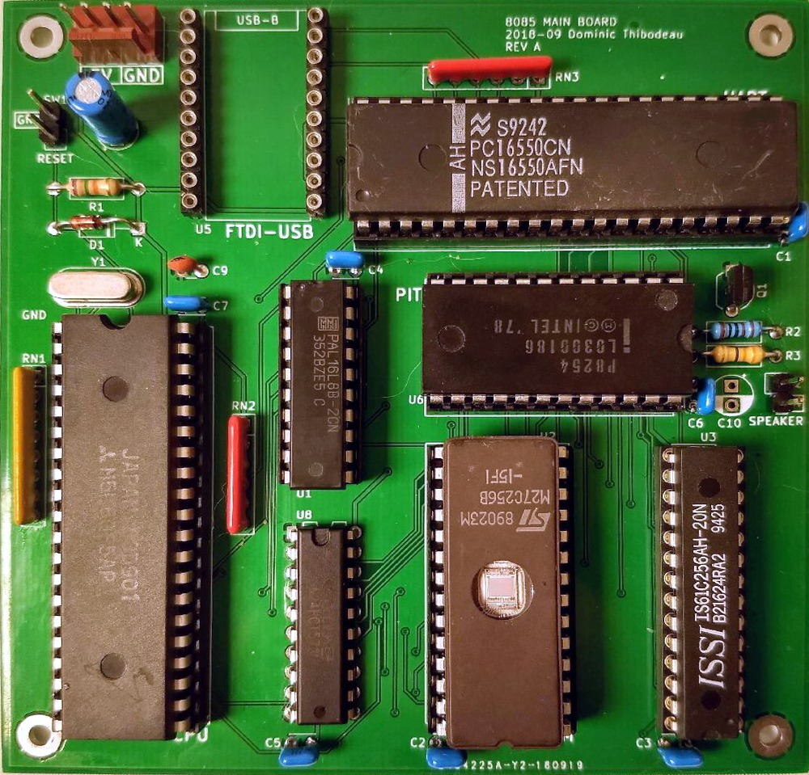

# 8085 Computer
Rev A September 2018

Based on original 2001 design

Features
============
- 32KB ROM 
  - Address [0x0000-7FFF]
- 32KB RAM
  - Address [0x8000-FFFF]
- 82C54 PIT (Programmable Interval Timer) 
  - Port [0x40-0x43]
- UART 8250 or 16550 
  - Port [0x60-0x67]
  - Connected to FTDI Serial<->USB Adapter

Notes
============
- No voltage regulation on board, no protection of any kind
- I made a somewhat working BASIC interpreter from scratch that runs on this hardware: [pfe_8085basic](https://github.com/hotkeysoft/pfe_8085basic)

Changes from original design
============
- Changed crystal to 4MHz (CPU Freq = 2MHz)
	- Original design ran at 1.8432MHz (CPU Freq = 921.6KHz)

- Replaced MAX232 chip with FTDI USB module

- Replaced 2 PLA (address latch) with one 74HCT573 (for A[0..7] only, not needed for A[8..15])

- Instead of MISC (0x80) port and additional logic for gating the sound, used /OUT1 of 8250 UART
	- /OUT2 remains unused
	- Needed to invert /OUT2 signal to gate 82C54 timer, and to invert the sound output
		- 2 inverters added to DTGLUE3 (see below)

- Removed IO Decoding chip, moved /UART and /PIT decoding to DTGLUE3
	- Removed IO Decoding for keyboard and LCD

- Glue logic PLA (DTGLUE3) improvements from original DTGLUE1 (see PLD/DTGLUE3.PDS)
	- Removed /IOR, /IOW, /MR, /MW - not needed with properly constructed /CS signals and CPU /WR /RD
		- Added IO Decoding (/CS signal for /UART and /PIT)
	- Removed ALE, no need for inverted signal since switching to 74HCT573
	- Replaced A15 A7 A6 A5 (redundant because A15 == A7 for IO) with A15 A14 A13
		- On 8085, for IO Ports, port address is on both A[0..7] AND A[8..15]
	- 3 inputs and 3 outputs remain on PLA, for future use	

Images
============
PCB Render                                       |  Real PCB
:-----------------------------------------------:|:--------------------------------------------:
 | 

### Schematics (pdf)
- [Complete schematics](./img/schema.pdf)

### PCB Images (svg)
- [Top](./img/pcb-front.svg)
- [Bottom](./img/pcb-back.svg)
