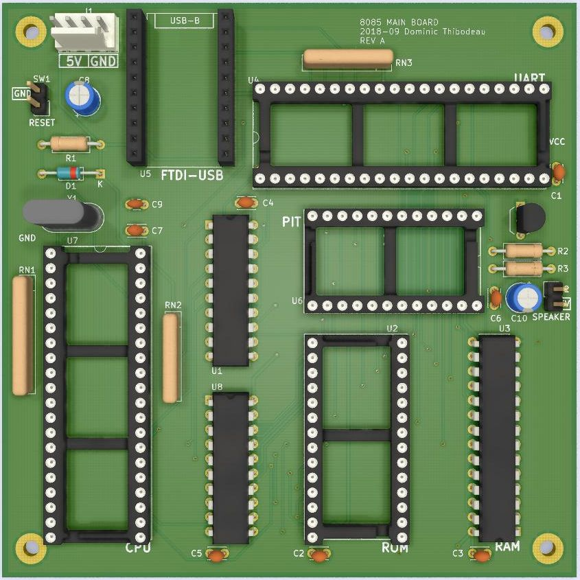

# 8085 Computer
Rev B September 2018

Based on original 2001 design

Features
============
- 32KB ROM 
  - Address [0x0000-7FFF]
- 32KB RAM
  - Address [0x8000-FFFF]
- 82C54 PIT (Programmable Interval Timer) 
  - Port [0x40-0x43]
- UART 8250 or 16550 
  - Port [0x60-0x67]
  - Connected to FTDI Serial<->USB Adapter

Notes
============
- This board was never produced. The FT232RL circuit was prototyped so in works in theory.
- No voltage regulation on board, no protection of any kind
- I made a somewhat working BASIC interpreter from scratch that runs on this hardware: [pfe_8085basic](https://github.com/hotkeysoft/pfe_8085basic)

Changes from Rev A
============
- Changed FTDI-USB module with FT232RL

Images
============
### PCB Render

### Schematics (pdf)
- [Complete schematics](./img/schema.pdf)

### PCB Images (svg)
- [Top](./img/pcb-front.svg)
- [Bottom](./img/pcb-back.svg)
