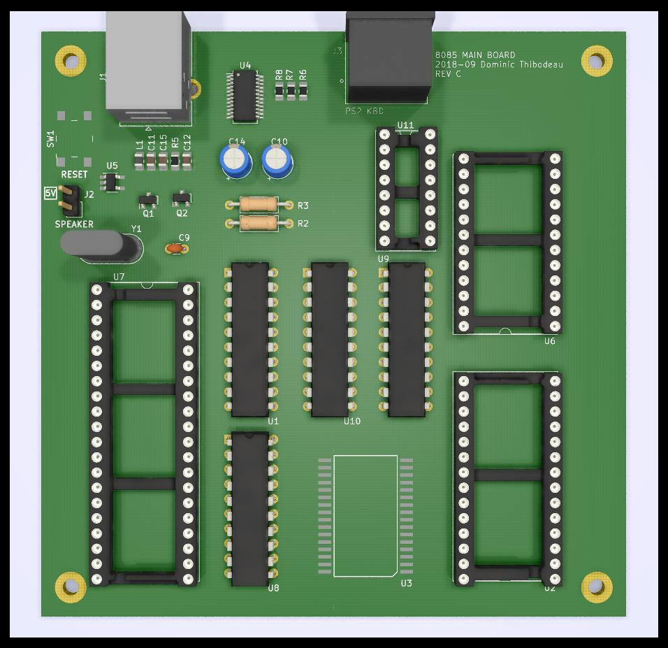

# 8085 Computer
Rev B September 2018

Based on original 2001 design

Features
============
- 32KB ROM 
  - Address [0x0000-7FFF]
- 128KB RAM
- USB-Serial IO (FT240x)
- 82C54 PIT (Programmable Interval Timer) 
- SN76489 Sound

Notes
============
- Work in progress
- See Rev A and B README

Changes from Rev B
============
- Switched RAM to 128KB SMD
- Replace UART + FT232RL to FT240x
	- Replaced interrupt with SID pin to check if data is ready
- Replace PIT sound with SN76489 chip
- Added 74HCT573 for banking register
- Changed 100ms timer from TRAP to RST7.5

- Glue logic PLA (DTGLUE4) changes from original DTGLUE1 & 3 (see PLD/DTGLUE4.PDS)
	- Removed inverters (used for PIT sound)
	- Added bank register select
	- Added /WR and /RD signals  (for bank register and FT240 r/w)

- Banking PLA (DTBANK1) added for memory banks management (see PLD/DTBANK1.PDS)

Memory Map
============
	- CPU Address divided in 8KB pages
```	
		PAGE 0 (ROM PAGE 0) 24KB (0x0000-0x5FFF)
		PAGE 1 (ROM PAGE 1)
		PAGE 2 (ROM PAGE 2)
		------------
		PAGE 3 (RAM PAGE 0) 24KB (0x6000-0xBFFF)
		PAGE 4 (RAM PAGE 1)
		PAGE 5 (RAM PAGE 2)
		------------
		PAGE 6 (BR0) 8 KB
		PAGE 7 (BR1) 8 KB
	
		BANK REGISTER
		| 7 | 6 | 5 | 4 | 3 | 2 | 1 | 0 |
		| 3 | 2 | 1 | 0 | 3 | 2 | 1 | 0 |
		|------BR1------|------BR0------|
		|    (0..15)    |		 (0..15)    |
		Selects from 128KB RAM page 0..15
```		

Port Map
============
Port Description
0x40 PIT
0x60 UART DATA (READ/WRITE)
0x80 SOUND CHIP
0xA0 BANK REGISTER

Images
============
### PCB Render


### Schematics (pdf)
- [Complete schematics](./img/schema.pdf)

### PCB Images (svg)
- [Top](./img/pcb-front.svg)
- [Bottom](./img/pcb-back.svg)
